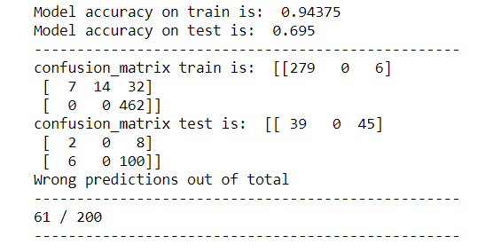

*SENTIMENT ANALYSIS [MACHINE LEARNING PROJECT] - With Dataset  
        *OBJECTIVES:   The sentiment analysis is a machine learning tool that analyzes texts for polarity (positive, Neutral, Negative)
By training machine learning tools with examples of emotions in text, machines automatically learn how to detect sentiment without human input.
 
* To know more about the applications of a sentiment analysis tool please visit our page: instagram: www.instagram.com/machinelearning.tg
 
* THE PROJECT STRUCTURE:  
Step a- Importing libraries  and  data. (The repo contains the dataset used in this project)  
Step b- Text normalization  
step c- Lemmatization  
step d- Data preprocessing  
step e- Model Building.  
  to build and train the model i use machine learning algorithms: Linear regression, Decision tree classifier, The random forest Classifier, K neighbors classifier and the support vector machines(SVM)
 
Some project's images:  

 

